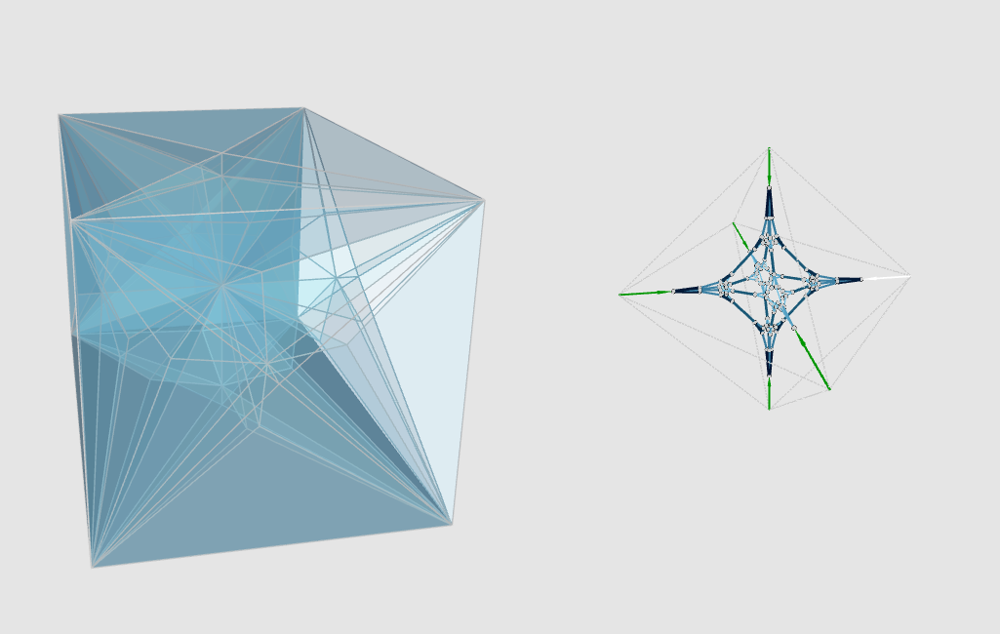

Web 3D interactive structural design tools based on reciprocal polyhedral diagrams
======================

[Live Demo](https://shrekshao.github.io/Polyhedron3D/)
(e.g. Load assets/models/test/example_03/diagram.json)

PennDesign RA project

#### Current-Test-ScreenShot


## Instructions

### Init

```
npm install
```

### Build and Run

```
npm run build-watch
```

This will watch any changes in the code and build the scripts. 
We use Webpack 2 to manage all the js scripts.

To run locally, simply launch a http server via python or node.js (Webpack also has some daemon server. You can always customize the `package.json` and `webpack.config.js`)

```
python -m SimpleHTTPServer
```

or (if you have node.js installed)

```
http-server
```

And then open `localhost:8080` in your browser.

## Docs

### format converter (python) `assets/models/txt2json_parser.py`

Convert a series of txt files generated by rhino 3d plugin to a json file. The code it self is pretty self explanatory. 

#### Usage

Customize the `foldername` (I'm lazy, a better way would be to modify the code to accept command line argument)

```python
foldername = "example_04"
```

Then run

```
python txt2json_parser.py
```


### WebGL viewer (Javascript)

The main files are `src/App.js` and `src/PolyhedralDiagram.js`, together with other libs and utils. The `src/App.js` manages three.js rendering stuffs, while `src/PolyhedralDiagram.js` takes care of loading and managing polyhedral json diagram. Detailed comments of class and API are within the code in JSDoc style. 
